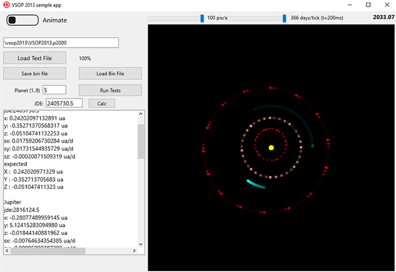

## VSOP2013 for Delphi ( and PlanetFun app )

VSOP 2013 (French: Variations Séculaires des Orbites Planétaires) is a high precision planetary position mathematical model, by G. FRANCOU & J.-L. SIMON (MAY 2013)

This is a Delphi port of original Fortran code by the theory authors.  
It is a large set of tables of  Chebyshev polynomial coeficients. 
Algorithm uses clever indexing to manage a large number of tables of Doubles, while keeping data file sizes minimum.
Tested with D10.3.3, D10.4 on Win32, iOS and Android. 

VSOP 2013 original files can be found at:

    ftp://ftp.imcce.fr/pub/ephem/planets/vsop2013/ephemerides/
 
README: ftp://ftp.imcce.fr/pub/ephem/planets/vsop2013/ephemerides/README.pdf
 
VSOP2013 data files are large (400 MB) ASCII text containing Chebyshev polynomial of 1st kind coeficients. 
It is organized in 6 files, covering a 9,000 year period in all, as follows:
  
     range                file
     -4500 to -3000       VSOP2013.m4000
     -3000 to -1500       VSOP2013.m2000
     -1500 to 0           VSOP2013.m1000
     0     to +1500       VSOP2013.p1000
     +1500 to +3000       VSOP2013.p2000
     +3000 to +4500       VSOP2013.p4000

Each file is divided in 17122, 32 day intervals. Each interval has 978 coeficients, arranged in groups of 6 per line. File header contains a table of indexes into coeficients for 9 planets: Mercury, Venus, Earth+Moon baricenter, Mars, Jupiter, Saturn, Uranus, Neptune and Pluto.
Planet Chebyshev polynomials can have from 7 to 14 terms. There are 6 components: 3 for position and 3 for speed.

The FTP repository also contains Fortran code:
* VSOP2013_binfile.f - Parses text file into binary file that allows fast random access.
* VSOP2013_compute.f - Retrieves 32d interval from binary file and computes planet data ( position and speed )

In this Delphi port, the whole ASCII file is loaded into memory tables, for even faster access. 
Once loaded, computations are very fast. 

Object T_VSOP2013_File in vsop2013.pas:
* Parses a data file - Use only files in original format, as the parser relies on fixed positions.
* Save and Load data in custom binary format files, smaller and fast to load (Android apps have a 150MB bundle size limit)
* calculates heliocentric rectangular position and speed ( in UA and UA/day)

# Sample apps
Two sample apps are included. 
* TestVSOP2013 - Load VSOP2013 text files. Test planet data. 2D visualization. Binary file utility. 
* PlanetFun - More complex 3D app. Requires downloading and installing planet textures and VSOP2013 binary file

# Sample app 1: TestVSOP2013
*TestVSOP2013* is a Firemonkey app. To use it you have to download at least one of the data files mentioned above, from VSOP2013 FTP repository ( current file is VSOP2013.p2000 )  

* Download VSOP2013.p2000 from FTP repository 
* Set filename and click [Load File] - This will freeze the app for a while, while it loads the 400 MB of text data.
* To test a particular planet position, set JD epoch, planet id and click [Calc]
* Check [x]Animate to show a solar system 2D animated chart.  Use trackbars to control scale and speed of the animation. 
* Click [Run tests] to compare some calculation results with expected values from original vsop2013. 
* [Save Binary file] for deploying with *PlanetFun*

# Test results

I did not test the original Fortran code, so I used the results on original file VSOP2013_ctl-1.txt.

    Test of Delphi implementation of VSOP2013
    ==========================================
    from VSOP2013_ctl.txt ( original results file)
      JUPITER     JD2405730.5  X: -5.392780445602 ua    Y: -0.805698954496 ua      Z :  0.124332318817 ua  
                              X':  0.001019284060 ua/d  Y': -0.007116469431 ua/d   Z':  0.000005921462 ua/d
						   
    from TestVSOP2013   ( code in this repo )
      Jupiter     jde2405730.5 x: -5.39278044560243 ua   y: -0.80569895449564 ua    z: 0.12433231881710 ua
                              sx: 0.00101928405984 ua/d sy: -0.00711646943146 ua/d sz: 0.00000592146220 ua/d			      
    
    from https://ssd.jpl.nasa.gov/horizons.cgi ( Nasa Horizons. used Jupiter Center and Sun  Center)
      Jupiter     jd2405730.5 (A.D. 1874-Jul-26 00:00:00.0000 TDB )  
                               X =-5.392781657192185E+00 Y =-8.056977928944861E-01 Z = 1.243323711175276E-01
                               VX= 1.019554845438113E-03 VY=-7.116569436623840E-03 VZ= 5.921987272194194E-06

## Sample app 2: PlanetFun

Planet Fun is a Firemonkey 3D solar system working model app. It uses VSOP2013 binary files to calculate planet positions.
Full souce code is available at:
    https://github.com/omarreis/vsop2013/tree/master/planetfun
    
PlanetFun readme:
    https://github.com/omarreis/vsop2013/blob/master/planetfun/README.md

In order to compile and run this app, you will need to:
* Download VSOP2013.p2000 data file from VSOP2013 FTP repository. Convert it to binary format using TestVSOP2013
* Download and include planet textures from 3rd party website

## app for Android
https://play.google.com/store/apps/details?id=com.omarreis.planetfun

## videos
* TestVSOP2013 - https://www.tiktok.com/@omar_reis/video/6850534226689805574
* PlanetFun - https://www.tiktok.com/@omar_reis/video/6859411602031119622

