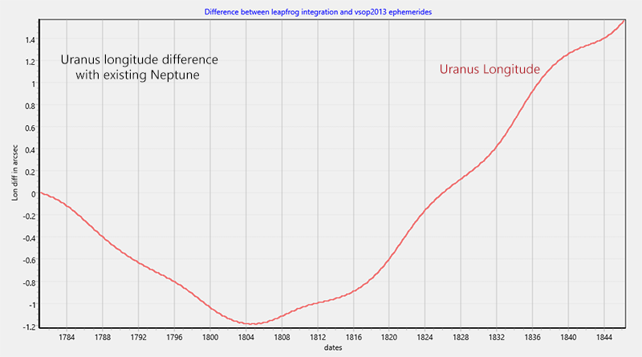

## The discovery of planet Neptune

In 1846 Urbain Le Verrier predicted the existence of a new planet,
never seen before by astronomers. He noticed perturbations in the 
orbit of Uranus not in conformity with Newton's Universal Gravitation formula.

The planet was later named *Neptune*.

Verrier guessed that another large planet should exist next to Uranus, 
to justify the diference between its expected and observed positions. 
Not only that, he estimated the position of the new planet, 
which was later confirmed by Berlin Observatory and reported to be 
near Verrier's prediction.

By the same time, english astronomer John Couch Adams was making
similar predictions, but published his results a little later.
Anyway, both are to be commended.

Details of this amazing discovery are missing ( at least for me )
so I did a numeric exercise to try to reconstruct some of the 
numbers Verrier had at the time (my numbers).  

## my numbers

Uranus was discovered in 13/mar/1781 by William Herschel.
By 1846 astronomers had about 65 years worth of Uranus observations (23741 days)

Uranus revolution around the Sun (its "year") is 30684 Earth days long, or 84 Earth years. 
By 1846, astronomers have recorded about 77% of the first Uranus lap around the Sun.  
Still the planet was misbehaving.

To simulate the planet observations at the time (which I didn't have), I used vsop2013 ephemerides. 

* see vsop2013 for Delphi: https://github.com/omarreis/vsop2013/

Leapfrog integration of gravity forces was used to simulate the calculations Verrier and Adams had.
Not sure how they worked the integration. Certainly with painfull hand calculations. 

Planets unknown at the time (Neptune and Pluto) were excluded from integration in this exercise.

* See leapfrog integration: https://github.com/omarreis/vsop2013/blob/master/gravityIntegration/README.md 
   
## gravityIntegration app

Using the leapfrog integration app *gravityIntegration* select:

  * select *[x]Uranus* chart
  * comparison=Longitude
  * interval=23741 days, 
  * DT=0.5 
  * start date 13/03/1781 
  * set Pluto and Neptune out of existence ( select planets and uncheck *Exists* checkbox )
  * click [Build charts]

In the resulting chart below we see that Uranus behaves nicely up to 1820, 
then it starts to drift away. By 1846, time of Neptune discovery, 
Uranus longitude integration was already 140 arcsec off,
a large diference that was certainly observable at the time.

If we restore Uranus in the calculations, we see that the longitude diference falls to 1.4 arcsec, or 1/100 of previous results. 

If we look at the actual positions chart of the planets in the period (below),
we see that in 1781, Uranus was about one quarter of revolution
behind Neptune.  Uranus revolution, being closer to the Sun,
is faster, so it catches up and eventually, around 1820, 
they meet at closest point.   

At this point, at a relatively small distance, gravity forces between planets 
are of maximum magnitude, but direction is along the orbit radius,
difficult to observe from Earth, and not affecting the planet's longitude. 

*Earth is the blue dot !*

After 1820 faster Uranus takes the lead in the orbit, 
with Neptune dragging it from behind. As time passes this drag from 
the unknown planet accumulates (see first chart).  

By 1846 the planet longitude was more than 2 arc minutes too slow .
Like Kepler before thjem, who had problems with Mars orbit, 
they struggled to fit Uranus' orbit into their numeric models. 

This, I guess, is what made Verrier and Adams consider a new planet.
I suppose they also relied on Kepler's 3rd law. Since the new planet was 
left behind by Uranus, its orbit was slower and hence more distant from the Sun.  

Since the planets sort of met around 1820, the new planet must have been 
with similar longitude at the time. Since Neptune rotates more slowly than Uranus, 
in 1846 its longitude must be closer to 1871 position, say 1/8 into the new orbit.
They knew Uranus was already about 1/4 into the new orbit. 
That hinted to the estimated position of the suspect.
We now know that Neptune revolution period is 60189 Earth days.
Period between the 2 planet meetings (closest point) is 62594 Earth days.

As for the mass of the new planet, it should be large enough to affect Uranus so much.
In fact Neptune is larger than Uranus, at 17.5 x the mass of Earth. 

    Earth    radius:6378.1 km    mass:5.97e+24 kg    rotPer:0.99    revPer:365.26  
    Uranus   radius:25559  km    mass:8.68e+25 kg    rotPer:0.72    revPer:30684  
    Neptune' radius:24764  km    mass:1.02e+26 kg    rotPer:0.67    revPer:60189  

My 5 cents

## also in this repository
* vsop2013 ephemerides for Delphi: https://github.com/omarreis/vsop2013/README.md
* gravity integration tool: https://github.com/omarreis/vsop2013/tree/master/gravityIntegration/README.md
* planetFun app: https://github.com/omarreis/vsop2013/tree/master/planetfun/README.md
* Neptune discovery: https://github.com/omarreis/vsop2013/blob/master/gravityIntegration/NeptuneDiscovery/README.md

## Installer for Windows 
Installs TestVSOP2013.exe, PlanetFun.exe, gravityIntegration.exe and VSOP2013.p2000.bin
https://github.com/omarreis/vsop2013/releases/download/1.1/setupVSOP2013_win32.exe

