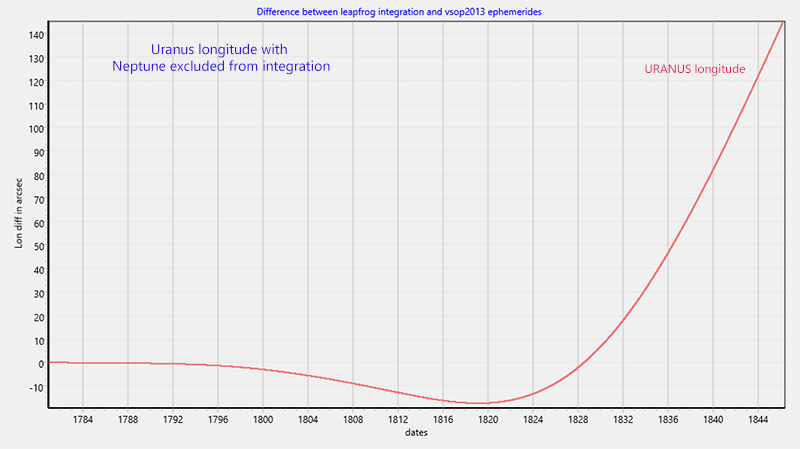
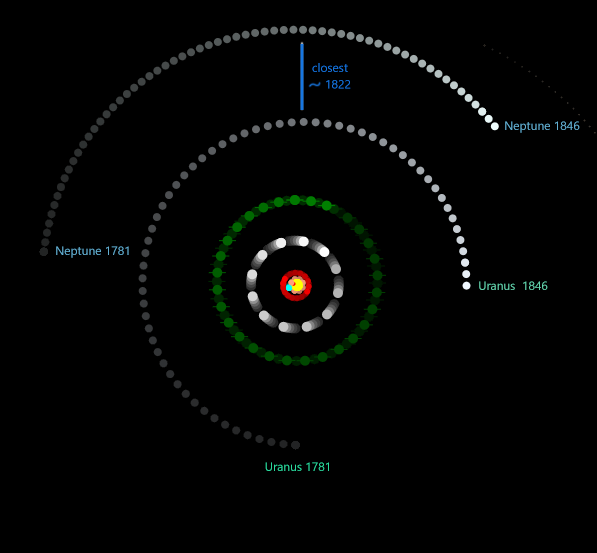
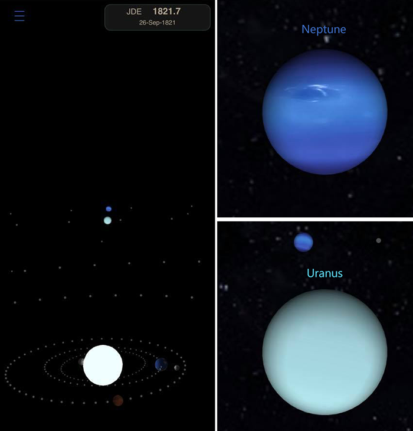

## A descoberta do planeta Netuno

Em 1846 Urbain Le Verrier previu a existência de um novo planeta,
nunca antes visto por astrônomos. Ele notou perturbações na órbita 
de Urano, não em conformidade com a Gravitação Universal de Newton.

O novo planeta foi chamado  *Netuno*.

Verrier pensou que outro grande planeta deveria existir, próximo a Urano,
para justificar a diferença entre suas posições esperadas e as observadas.
Não só isso, ele estimou a posição do novo planeta,
que foi posteriormente confirmado pelo Observatório de Berlim perto 
da posição prevista por Verrier.

Ao mesmo tempo, o astrônomo inglês John Couch Adams estava fazendo
previsões semelhantes, mas publicou seus resultados um pouco mais tarde.
De qualquer forma, ambos devem ser elogiados.

Detalhes desta descoberta incrível estão faltando (pelo menos para mim)
então fiz um exercício numérico para tentar reconstruir alguns dos
números que Verrier tinha na época (meus números).

## meus números

Urano foi descoberto em 13/mar/1781 por William Herschel.
Em 1846, os astrônomos tinham cerca de 65 anos de observações de Urano (23741 dias)

A revolução de Urano em torno do Sol (seu "ano") demora 30.684 dias terrestres, ou 84 anos.
Então em 1846 os astrônomos tinham registrado cerca de 77% da primeira volta de Urano ao redor do Sol.
Mesmo assim, o planeta estava se comportando mal.

Para simular as observações do planeta na época (o que eu não tinha), usei as efemérides vsop2013.

* veja vsop2013 para Delphi neste repositório: https://github.com/omarreis/vsop2013/

A integração tipo Leapfrog das forças de gravidade foi usada para simular os cálculos que Verrier e Adams tinham.
Não sei como eles faziam essa integração. Certamente com cálculos manuais demorados e repetitivos.

Planetas desconhecidos na época (Netuno e Plutão) foram excluídos da integração na primeira parte do exercício.

* Mais sobre integração leapfrog: https://github.com/omarreis/vsop2013/blob/master/gravityIntegration/README.md
   
## aplicativo gravityIntegration

Usando o aplicativo de integração leapfrog *gravityIntegration* neste repositorio, selecione:

  * selecione o gráfico de *[x]Uranus* 
  * comparação = Longitude
  * intervalo = 23741 dias,
  * DT = 0,5
  * data de início 13/03/1781
  * excluir os planetas Plutão e Netuno do cálculo (selecione planetas e desmarque a caixa de seleção *Exists*)
  * clique em [Build chart]

No gráfico resultante abaixo, vemos que Urano se comporta bem até 1820, então começa a se afastar.
Em 1846, época da descoberta de Netuno, a integração da longitude de Urano já estava do observado cerca de 140 segundos de arco,
uma grande diferença, observável na época.

Se restaurarmos *Neptuno* nos cálculos, vemos que a diferença de longitude cai para 1,4 segundos de arco, ou 1/100 dos resultados anteriores. Claramente, a influência de Netuno na órbita de Urano é grande. Plutão, por outro lado, é tão pequeno que não detectei nenhuma mudança ao incluí-lo ou não.

Se olharmos para o gráfico de posições reais dos planetas no período (abaixo),
vemos que, em 1781, Urano estava cerca de um quarto da revolução atrás de Netuno. 
O periodo de revolução de Urano, estando perto do Sol, é mais rápido que o de Netuno. 
Então ele alcança Netuno por volta de 1821 (no ponto mais próximo das órbitas).

Neste ponto, a uma distância relativamente pequena, as forças da gravidade entre os planetas
são de magnitude máxima, mas a direção das forças é ao longo do raio da órbita,
difícil de observar daqui da Terra e que não afeta a longitude do planeta.

* A Terra é o ponto azul! *

Depois de 1820, Urano assume a liderança na órbita,
com Netuno arrastando por trás. Conforme o tempo passa, esse arrasto do
planeta desconhecido se acumula (veja no primeiro gráfico).

Em 1846, a longitude do planeta era mais de 2 minutos de arco mais lenta.
Como Kepler antes deles, que teve problemas com a órbita de Marte,
eles lutaram para encaixar Urano em seus modelos numéricos.

Acho que foi isso que fez Verrier e Adams considerarem um novo planeta.
Suponho que eles também confiaram na 3ª lei de Kepler. Já que o novo planeta foi
deixada para trás por Urano, sua órbita era mais lenta e, portanto, mais distante do sol.

Como os planetas se encontraram por volta de 1821, o novo planeta deve ter sido
com longitude semelhante na época. Uma vez que Netuno gira mais lentamente do que Urano,
em 1846 sua longitude deve estar mais próxima da posição de 1871, digamos 1/8 na nova órbita.
Eles sabiam que Urano já estava cerca de 1/4 da nova órbita.
Isso indicava a posição estimada do suspeito.

Agora sabemos que o período da revolução de Netuno é 60.189 dias terrestres.
O período entre os 2 encontros dos planetas (ponto mais próximo) é de 62594 dias terrestres.

Se olharmos novamente para o primeiro gráfico, vemos que Urano acelerou entre
1800 e 1820 à medida que se aproximava de Netuno (mudança negativa da diferença de longitude),
antes da oposição. Só que a influência não foi tão grande como depois.

Quanto à massa do novo planeta, deve ser grande o suficiente para afetar tanto Urano.
De fato, Netuno é maior do que Urano, com 17,5x a massa da Terra.

    Raio da Terra: 6378,1 km  massa: 5,97e + 24 kg  rotPer: 0,99  revPer: 365,26
    Raio de Urano:  25559 km  massa: 8,68e + 25 kg  rotPer: 0,72  revPer: 30684
    Raio de Netuno: 24764 km  massa: 1,02e + 26 kg  rotPer: 0,67  revPer: 60189
    

Meus 5 centavos

## também neste repositório
* vsop2013 efemérides para Delphi: https://github.com/omarreis/vsop2013/README.md
* ferramenta de integração de gravidade: https://github.com/omarreis/vsop2013/tree/master/gravityIntegration/README.md
* app planetFun: https://github.com/omarreis/vsop2013/tree/master/planetfun/README.md
* Descoberta de Netuno: https://github.com/omarreis/vsop2013/blob/master/gravityIntegration/NeptuneDiscovery/README.md

## Instalador para Windows
Instala TestVSOP2013.exe, PlanetFun.exe, gravityIntegration.exe e VSOP2013.p2000.bin
* https://github.com/omarreis/vsop2013/releases/download/1.1/setupVSOP2013_win32.exe

Instalador de Windows assinado por Carvalho e Reis Ltda (authenticode)

## videos
https://www.tiktok.com/@omar_reis/video/6868280053218823426

https://www.facebook.com/watch/?v=927266577766578&extid=zL8tulVwXybECcdZ

