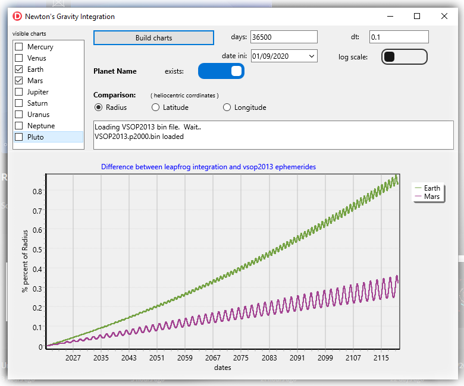
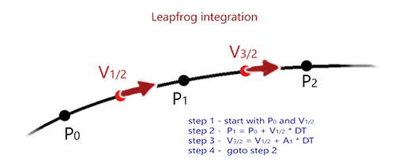

## Newton's Gravity Integration

*GravityIntegration* app implements Newton's gravity integration over time.
It calculates planet's position and speed by integrating the attraction forces
between the 9 planets and the Sun. 

The app uses VSOP2013 ephemerides as basis for comparison, and produces charts 
of differences between planet's calculated and "observed" positions.

You can chart differences in positions using heliocentric spherical coordinates: 

* radius difference ( in % of radius ) 
* latitude difference ( in arcsecs )
* longitude difference ( in arcsecs )

Longitude is the most important property for us (Earth based astronomers),
because it is easily observed with telescopes. Distances ( aka planet radius )
are more difficult to observe.

## Leapfrog integration
*Newton's Universal Gravitation* formula for the force between two objects is simple: 

    F = G * M1 * M2 / D^2
    where
      F = attraction force between objects
      G = Universal gravitation constant
      M1, M2 = masses of the objects
      D = Distance between objects centers
    
Summing the effect of all these forces can be tricky. Not only does each object (ex: a planet) 
attracts all others, but the magnitude and direction of the forces change continuously
as objects move. 

One approach to calculate position and speed of a planet at a certain time is to divide 
the time in small intervals DT, and calculate object state incrementally by adding DTs.
This numerical integration starts at a known time-position-speed T0.

     Ai = Sum (G*M/D^2)     <-- sumatory of gravity acceleration due to all objects ( N-to-N attraction)
     Pi+1 = Pi + Vi * DT    <-- position vector change 
     Vi+1 = Vi + Ai * DT    <-- speed vector acceleration 
     goto to next i 
  
This is called *Euler* method. It may look ok, but with elliptical or parabolic orbits, 
speeds are systematically off the mark which results in continuous drift 
from actual values.

A better calculation method is the so called *leapfrog* integration.
It also starts with P0 ( position at time T0 ), but uses V1/2 ( speed at time DT/2 ) instead of V0.  
Because V1/2 is a much better estimate of mean speed in the T0->T1 interval
than V0 is, leapfrog integration results are much better Euler's.

Note that there are even better integration methods, but leapfrog so simple and ellegant :)  

The leapfrog integration algorithm goes like this:

     Pi+1   = Pi + Vi+1/2 * DT     <-- position vector change using V1/2, in the middle of the segment
     Ai = Sum (G*M/D^2)            <-- sumatory of gravity acceleration due to all objects
     Vi+3/2 = Vi+1/2 + Ai * DT     <-- speed vector acceleration 
     goto to next i 
    
While Euler integration is first order, leapfrog is second order (meaning that the error
is proportional to 1/DT^2 instead of 1/DT ). So error reduces fast when we use
a small enough DT.

# Discovery of planet Neptune
As an application of leapfrog integration, I tried to reconstruct some of the 
numbers that led to the discovery of planet Neptune in 1846, even
when no one had seen it before. See:

https://github.com/omarreis/vsop2013/blob/master/gravityIntegration/NeptuneDiscovery/README.md

