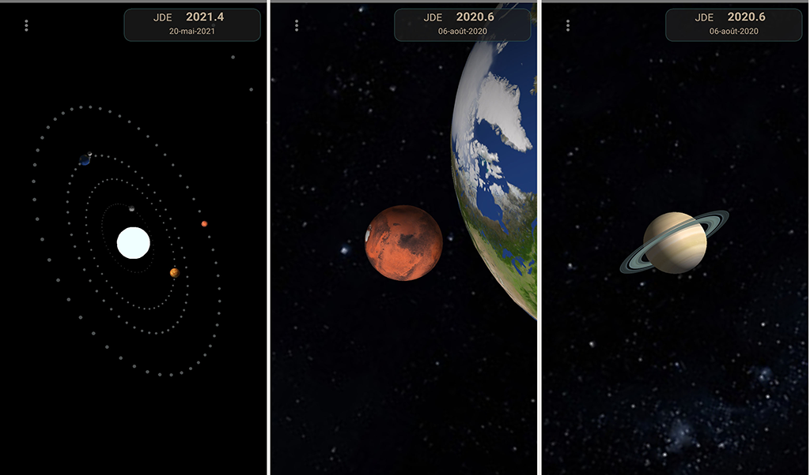

## Planet Fun

Planet Fun is a solar system working model in 3D.  Program is a Delphi Firemonkey 3D multi-platform app, and was tested on Windows, Android and iOS (w/ Delphi 10.4 Seattle)

Full app source code is available at:

https://github.com/omarreis/vsop2013/planetfun

# Planet positions

Planet positions are calculated using VSOP2013 ephemerides ( see https://github.com/omarreis/vsop2013 ) 
This library is used to calculate high resolution planet heliocentric coordinates, between epochs 1500 to 3000.
( VSOP2013 by Francou and Simon )

see ftp://ftp.imcce.fr/pub/ephem/planets/vsop2013/ephemerides/

VSOP2013 files are not in this repository.
* Download VSOP2013.p2000 from the FTP repository above ( a 400 MB file) 
* Use program TestVSOP2013 to load VSOP2013.p2000  and save VSOP2013.p2000.bin, a binary file containing VSOP2013 data. Do *not* use binary files from original repository.
* Deploy file VSOP2013.p2000.bin with the app.

# Planet textures

Program sources are *almost ready* to compile. 
Planet 3D textures are *not* included in this repository. You can find suitable and free textures on this website:

*Solar System Scope*   https://www.solarsystemscope.com/textures/

* Download files: 2k_earth_daymap.jpg, 2k_jupiter.jpg, 2k_mars.jpg, 2k_mercury.jpg, 2k_moon.jpg, 2k_neptune.jpg, 2k_saturn.jpg, 2k_stars_milky_way.jpg, 2k_uranus.jpg, 2k_venus_surface.jpg and PlutoTexture.jpg
* On the program Form, load each image into the corresponding lightMaterialTextureXXX object. For instance load file '2k_jupiter.jpg' into lightMaterialTextureJupiter. And so on.
* Once you have loaded the textures for the 9 planets, Sun, Moon and stars background, you are ready to compile the project.

# What is not realistic
* Planet sizes in the real solar system are difficult for computer visualization. The Sun radius is more than 100x that of the Earth. Distance between planets and the Sun are even larger. If you do a program using real proportional sizes, you end up with a black screen with some tiny dots. So I applied a log formula to Sun and planet sizes, so that the Sun is only 4x the size of the Earth. Planet scale can be changed for more visible planets.
* Moon position, size and orbit size are not connected to real coordinates yet (TODO)

# Program features
* Solar system *animation* with configurable speed
* Choose camera target (Sun or planets)
* Set date/time bewteen years 1500 and 3000
* Configurable camera distance-to-target
* Touch gestures: one finger pan, two finger zoom and two finger rotation (on mobile)
* Mouse events with mouse-move, Shift mouse-move and Alt mouse-move (on Windows)

keywords: solar system planet astronomy vsop2013 
