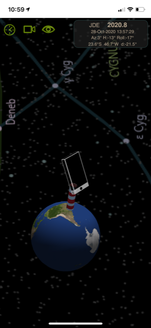

# Planet Fun      

Planet Fun is a solar system working model in 3D.  
Program is a Delphi Firemonkey 3D app. 
Tested on Windows, Android and iOS (currently Delphi 10.4)

Full app source code is available at:

* https://github.com/omarreis/vsop2013/tree/master/planetfun

# Oct-20 - PlanetFun version 1.3 for iOS and Android released
New in this version:
* Integrated phone sensors to the 3D simulation ( GPS, accelerometer and mag compass )
* A fairly large *lighthouse* is positioned at your GPS position
* On the lighthouse there is a phone. The virtual phone attitude (Azimuth,Elevation and Roll) is controlled by phone sensors 
* If you attach the Camera to the phone you create a phonecentric universe ( augmented reality ) 
* Permission for "sensor use while using the app" is required

Search for "PlanetFun" on your app store.

# TODO list
* Apply correct Moon ephemeris ( not this fake movement ) 

# Program features
* Multi platform: Android, iOS and Windows
* Solar system *animation* with configurable speed
* Choose camera target (Sun, planets, lighthouse or phone)
* Set date/time bewteen years 1500 and 3000
* Configurable camera distance-to-target
* Touch gestures: one finger pan, two finger zoom and two finger rotation (on mobile)
* Mouse events: mouse-move, Shift mouse-move and Alt mouse-move (on Windows)
* Planet orbit dots. Each orbit is represented by 52 dots ( For the Earth, it is 1 dot per week) )
* Solar system heliocentric axis (x and z)
* VSOP2013 planet ephemeris usage sample
* Current catalog is small: Sun, 9 planets and Moon
* Sky background with 40k stars
* Star and constellation names
* constellation lines
* Sensor fusion allows positioning the light house on GPS position, and set phone attitude acording to gyro and compass
* Attach camera to the phone to enter augmented reality mode

# Planet positions

Planet positions are calculated using VSOP2013 ephemerides ( see https://github.com/omarreis/vsop2013 ) 
This library calculates planet's heliocentric coordinates for epochs 1500 to 3000.
( VSOP2013 by Francou and Simon )

    see ftp://ftp.imcce.fr/pub/ephem/planets/vsop2013/ephemerides/

VSOP2013 data files are not in this repository. Download from FTP .

For speed and bundle size, PlanetFun app uses a custom binary version of VSOP2013 data ( same idea as original vsop2013 but with a different implementation )

So the steps to obtain planet ephemeris file are:

* Download VSOP2013.p2000 from the FTP repository above ( a 400 MB text file) 
* Use program *TestVSOP2013* to Load VSOP2013.p2000 text file.
* Save binary file VSOP2013.p2000.bin.   Do *not* use binary files from original FTP repository.  Binary files for this app use a different custom format.
* Deploy file VSOP2013.p2000.bin to app's documents folder. 

Resulting binary file is *only* 131 MB and doesn't require parsing to load. Loads much faster. 

The scale factor between astronomical units and the app's 3D world is 1.0:     
     1.0 AU = 1.0 3D-world-unit  
    
ex: Earth orbit radius is ~around~ 1.0 3D-world-units

# Planet textures

Planets are represented by TSpheres with light reflecting surfaces ( TLightMaterialSource )
The Texture property is a bitmap that is mapped to the sphere, on a reverse-Mercator projection.  
Most planet textures are *not* included in this repository ( TForm planets have blank textures )
Except for sky background textures, which is included ( see Documents folder for deployment info )

You can find suitable and free textures on this website:

*Solar System Scope*   https://www.solarsystemscope.com/textures/  

steps to complete PlanetFun assets:

* Download texture images: ex: 2k_earth_daymap.jpg, 2k_jupiter.jpg, 2k_mars.jpg, 2k_mercury.jpg, 2k_moon.jpg, 2k_neptune.jpg, 2k_saturn.jpg, 2k_stars_milky_way.jpg, 2k_uranus.jpg, 2k_venus_surface.jpg and PlutoTexture.jpg
* Deploy these files to Documents folder 
* Deploy files SkyMapLinesNames.png and SkyMapPlain.png from this repository:

PlanetFun deployments: https://github.com/omarreis/vsop2013/tree/master/Documents

Follow *Solar System Scope* license conditions ( Attribution 4.0 )

# Star background texture
The sky background is a flat jpg image mapped to a sphere of radius 200 au.
It was generated using Hipparcos Input Catalogue (118k stars)
Only objects with mag<8.0 were kept, resulting in 42k stars.
Two star background maps available: with names and lines or plain stars.

# 3d world 
The 3d world in this simulation uses ecliptic coordinates (x,y,z) in au. This is the same convention as vsop2013 results (the planet ephemeris used). This means that both the Earth and Star background spheres are tilted by 23°26′ (Earth's obliquity). Other planets orbit's are nearly parallel to Earth's, so planets z coordinates are usualy small ( except for Pluto which has a much larger obliquity ) 

# Warning: not realistic
* Solar and planet sizes are difficult for visualization. The Sun radius is more than 100x that of the Earth. Distance between planets and the Sun are even larger. If you do a program using actual proportional object sizes, you end up with a black screen and some tiny dots. Not really exciting.   I applied a log formula to Sun and planet sizes so that the Sun is only about 4x the size of the Earth. Anyway, planet scale can be configured for more visible planet details.
* Moon position, speed, size and orbit size are not connected to real world coordinates yet. Anyway, Moon revolution ( 27.32 days) is so much faster than other celestial objects, it is all over the place when animated. In this illustration, it is animated on a circular orbit and with uniform, slow speed. Fake (TODO)
* Version 1.3 includes sky background textures ( with and w/o names and lines )

# Dependencies
*  Uses astronomy files from https://github.com/omarreis/vsop2013/
*  Uses sensor fusion component from https://github.com/omarreis/FiremonkeySensorFusion
*  Uses sensor code and KastriFree by DelphiWorlds (files with DW. prefix, included in this repo) 

# Astronomical Algorithms formulas
Many formulas and algorithms for dates and astronomy from the book "Astronomical Algorithms" by Jean Meeus.
See file Om.AstronomicalAlgorithms.pas

# video
https://www.tiktok.com/@omar_reis/video/6859411602031119622

keywords: solar system planet astronomy vsop2013 Delphi Firemonkey

## download Android app
https://play.google.com/store/apps/details?id=com.omarreis.planetfun

## download iOS app
https://apps.apple.com/us/app/planet-fun/id1525941640

## also in this repository
* vsop2013 ephemerides for Delphi: https://github.com/omarreis/vsop2013/README.md
* gravity integration tool: https://github.com/omarreis/vsop2013/tree/master/gravityIntegration/README.md
* planetFun app: https://github.com/omarreis/vsop2013/tree/master/planetfun/README.md
* Neptune discovery: https://github.com/omarreis/vsop2013/blob/master/gravityIntegration/NeptuneDiscovery/README.md

